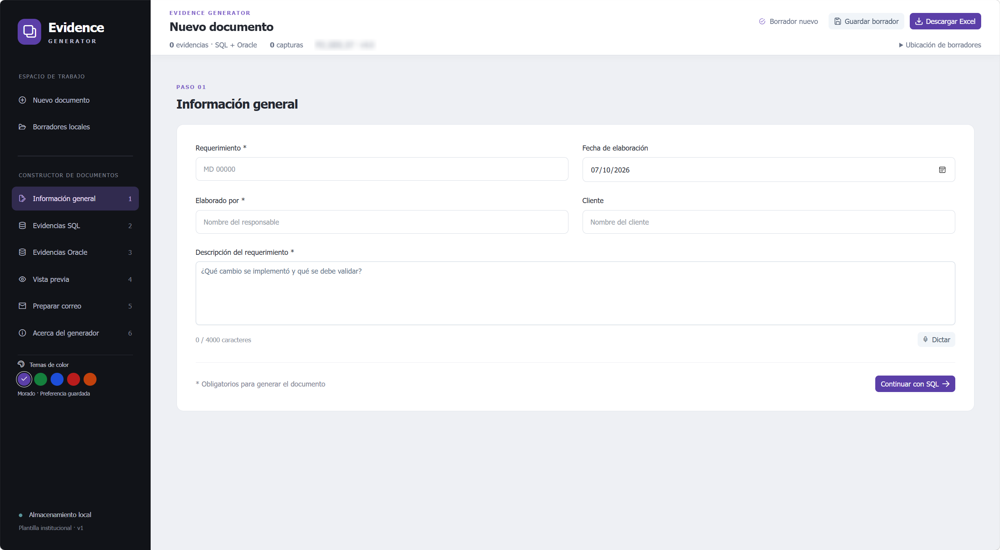

# Evidence Generator

Aplicación local para documentar pruebas de requerimientos: organiza evidencias SQL/Oracle, genera un Excel con la plantilla institucional y prepara el correo de validación. No ejecuta consultas SQL/Oracle ni envía correos automáticamente.

## Vista de la aplicación

Pantalla principal de Evidence Generator con el tema morado: información general del requerimiento, navegación por secciones y acciones para guardar el borrador o descargar el Excel.



## Índice

- [Requisitos y descargas](#1-requisitos-y-descargas)
- [Instalar los paquetes](#2-instalar-los-paquetes)
- [Iniciar y detener](#3-iniciar-y-detener)
- [Cómo utilizarlo](#4-cómo-utilizarlo)
- [Compilar y probar](#5-compilar-y-probar)
- [Publicar para otro equipo](#6-publicar-para-otro-equipo)
- [Datos y respaldos](#7-datos-y-respaldos)
- [Problemas frecuentes](#8-problemas-frecuentes)
- [Arquitectura y documentación](#9-arquitectura-y-documentación)

## 1. Requisitos y descargas

Para trabajar desde el código fuente en Windows x64:

| Herramienta | Para qué se utiliza | Descarga |
|---|---|---|
| **.NET SDK 10 x64** | Restaurar paquetes NuGet, compilar y ejecutar la API | [Descargar .NET 10](https://dotnet.microsoft.com/en-us/download/dotnet/10.0). Elegir **SDK**, no solamente Runtime |
| **Node.js 24 LTS x64 con npm** | Instalar paquetes, iniciar y compilar el frontend | [Descargar Node.js](https://nodejs.org/en/download). Seleccionar Windows e instalador MSI |
| **Microsoft Edge** | Usar la aplicación y ejecutar las pruebas de navegador configuradas | El navegador debe estar instalado para `npm run test:e2e` |
| Editor de código, opcional | Modificar el proyecto | Visual Studio o Visual Studio Code, según preferencia |

El SDK de .NET incluye los runtimes necesarios para desarrollar. El instalador habitual de Node.js incluye npm. No necesitas instalar Vue, Vite, PrimeVue, Quill ni SQLite globalmente, ni instalar SQL Server u Oracle para usar el generador.

Las pruebas anteriores se ejecutaron con .NET SDK **10.0.401** y Node **20.20.2**. Para una instalación nueva se recomienda Node 24 LTS: Node 20 ya figura fuera de soporte en la [página oficial](https://nodejs.org/en/download). El cambio a Node 24 debe validarse con las pruebas de la sección 5; no implica que ya se haya probado esa versión en este equipo.

Después de instalar las herramientas, abre una terminal nueva y comprueba:

```powershell
dotnet --list-sdks
node --version
npm.cmd --version
```

`global.json` solicita SDK 10.0.100 con `rollForward: latestFeature`, por lo que admite versiones de característica posteriores dentro de .NET 10. Conserva ese archivo.

## 2. Instalar los paquetes

Clona, copia o extrae el proyecto en la carpeta que prefieras. Abre PowerShell en la **raíz del proyecto**, donde se encuentran `EvidenceGenerator.slnx`, `Iniciar.cmd` y este README. Todos los bloques de comandos siguientes parten de esa raíz y utilizan rutas relativas, independientemente de la unidad o carpeta elegida por cada desarrollador. Necesitas conexión a internet en la primera restauración y cuando falten paquetes en la caché.

**Paso 1 — Paquetes del backend y pruebas (.NET/NuGet):**

```powershell
dotnet restore .\EvidenceGenerator.slnx
```

Descarga las dependencias declaradas en los `.csproj`: SQLite, soporte de pruebas ASP.NET Core, xUnit y Open XML para validación, entre otras. No tienes que descargarlas una por una. `dotnet run`, `build` y `test` también pueden restaurarlas automáticamente.

**Paso 2 — Paquetes del frontend (npm):**

```powershell
Push-Location .\src\evidence-generator-web
npm.cmd ci
Pop-Location
```

Instala dependencias de ejecución y desarrollo en `node_modules` utilizando las versiones de `package-lock.json`. Incluye Vue, PrimeVue, Quill, DOMPurify, Vite, TypeScript, Vitest y Playwright. No uses `--omit=dev` si vas a iniciar Vite, compilar o ejecutar pruebas.

`npm ci` reconstruye `node_modules` y falla si `package.json` y el archivo de bloqueo no coinciden; no modifica el bloqueo para resolver diferencias. Detén el frontend antes de ejecutarlo. Consulta [npm ci](https://docs.npmjs.com/cli/v11/commands/npm-ci/).

**¿Cuándo repetir estos pasos?** Al instalar en otro equipo, descargar una nueva versión con cambios de dependencias o recuperar una carpeta de paquetes faltante. No es necesario repetirlos cada vez que abras la aplicación.

**¿Cómo agregar un paquete durante el desarrollo?** Usa los siguientes comandos solo si necesitas una dependencia nueva; sustituye los nombres de ejemplo:

```powershell
Push-Location .\src\evidence-generator-web
# Paquete de ejecución
npm.cmd install nombre-del-paquete

# Herramienta de desarrollo
npm.cmd install --save-dev nombre-del-paquete
Pop-Location

# Desde la raíz: paquete NuGet para la API
dotnet add .\src\EvidenceGenerator.Api\EvidenceGenerator.Api.csproj package Nombre.Del.Paquete
```

Versiona los cambios en `package.json`, `package-lock.json` y los `.csproj`. No versionar `node_modules`, `bin` ni `obj`. Conserva las versiones fijadas de PrimeVue, Aura y Quill hasta evaluar una actualización y probarla; no ejecutes actualizaciones forzadas como parte de la instalación normal.

## 3. Iniciar y detener

### Un solo comando

Desde PowerShell, en la raíz de tu copia del proyecto:

```powershell
.\Iniciar.cmd
```

También puedes hacer doble clic en **Iniciar.cmd** o crear un acceso directo a ese archivo.

El lanzador comprueba herramientas y puertos, instala los paquetes npm si falta `node_modules`, inicia la API y abre el navegador. Si los puertos 5080 o 5173 están ocupados por una instancia de este mismo proyecto, la cierra automáticamente, espera a que se liberen y vuelve a iniciar ambos servicios. Antes de reiniciar, guarda tus cambios pendientes. Si el puerto pertenece a otra aplicación o no se puede verificar el proceso, se detiene e informa su PID sin cerrarlo.

- **Aplicación:** [http://127.0.0.1:5173](http://127.0.0.1:5173/).
- **Estado de la API:** [http://127.0.0.1:5080/api/health](http://127.0.0.1:5080/api/health).
- **Detener:** Ctrl+C en la terminal que inició la aplicación. Mantén esa terminal abierta mientras la utilizas; Windows puede pedir confirmar el cierre del lote.
- **Sin abrir navegador:** `.\Iniciar.cmd -NoBrowser`.

Si cambió el archivo de dependencias y `node_modules` ya existe, ejecuta manualmente `npm.cmd ci` antes de iniciar. El lanzador no actualiza una instalación existente automáticamente.

`Iniciar.cmd` utiliza `ExecutionPolicy Bypass` solo para su proceso; no cambia la política global. Una política corporativa puede impedir su ejecución. En ese caso usa las terminales siguientes o solicita a TI la aprobación del script.

### Inicio manual, dos terminales

Terminal 1 — API:

```powershell
dotnet run --project .\src\EvidenceGenerator.Api --no-launch-profile --urls http://127.0.0.1:5080
```

Terminal 2 — interfaz, después de instalar los paquetes:

```powershell
Push-Location .\src\evidence-generator-web
npm.cmd run dev -- --host 127.0.0.1 --port 5173 --strictPort
Pop-Location
```

En este modo debes detener ambas terminales con Ctrl+C. No inicies el lanzador a la vez que estas dos sesiones.

## 4. Cómo utilizarlo

1. En **Perfil y configuración**, guarda nombre, foto opcional, carpeta Excel, firma, contactos y ambientes. Al crear documentos nuevos, el responsable se completa con tu nombre. Completa requerimiento, fecha, cliente y descripción.
2. En SQL y Oracle selecciona una URL y una conexión de sus listas independientes, o escríbelas manualmente. Las listas se comparten entre ambos motores; elegir una URL no cambia la conexión.
3. Agrega evidencias: cada una tiene descripción y **una imagen**. Puedes cargar, arrastrar o pegar con Ctrl+V en el área de imagen. Para reemplazarla, quita la actual. Las evidencias se pueden ordenar, plegar y eliminar con confirmación. El botón **Agregar evidencia** permanece fijo abajo y lleva a la evidencia nueva.
4. Pulsa **Guardar borrador**. En **Borradores locales** puedes buscar por requerimiento, cliente o descripción, filtrar por fecha del documento, abrir o eliminar. Eliminar un documento es definitivo; eliminar una evidencia se conserva al guardar el borrador.
5. Si no configuras una ruta o la dejas vacía, se usará **Descargas del usuario de Windows**. Pulsa **Guardar Excel**: elige **Preguntar ubicación** para indicar una ruta completa, o **Carpeta configurada**. El archivo del mismo requerimiento se actualiza en esa carpeta, sin sufijos. Cierra Excel antes de reemplazarlo. La ruta efectiva aparece en **Ubicación de borradores**. Las imágenes ocupan **42 filas de altura original**, con ancho proporcional y borde oscuro de 1 pt. El área de impresión se amplía cuando hace falta. La vista previa no reproduce la paginación exacta de Excel.
6. En **Preparar correo**, despliega Destinatarios y asunto, personaliza el cuerpo y configura la firma plegable. Los avisos ambiental/confidencialidad son fijos. Selecciona contactos filtrando por nombre/correo en Para y CC. Abre **Vista previa del correo** para ver una hoja de solo lectura separada del editor. Copia con **Copiar correo** y pega en Outlook usando formato HTML y **Mantener formato de origen**; adjunta el Excel.

El cuerpo personalizado se guarda con el borrador. **Regenerar desde los datos** reemplaza esa personalización tras confirmar. La compatibilidad del pegado y las imágenes de firma depende del cliente de correo.

Las notificaciones flotantes se cierran tras 5 segundos activos; el cursor o el foco de teclado pausan el contador. Los errores permanecen hasta cerrarlos con la X. La cabecera fija mantiene disponibles acciones y resumen. La interfaz usa Tahoma con tamaño base de 12 px; el correo conserva sus tamaños independientes. Los temas de color se recuerdan en una cookie. **Acerca del generador** explica el objetivo y las tecnologías. El dictado necesita permisos y puede utilizar el servicio en línea del navegador.

Los borradores antiguos con varias imágenes se separan en evidencias individuales al abrirlos, sin perder capturas; se guardan convertidos cuando lo decides. Si exceden 50 evidencias por motor, la interfaz informa para distribuir el contenido.

## 5. Compilar y probar

Detén la API antes de compilar o probar .NET en Windows para evitar bloqueo de ejecutables. Para las pruebas integrales, deja libre el puerto 5080; lo más sencillo es detener toda la aplicación.

Backend, desde la raíz:

```powershell
dotnet build .\EvidenceGenerator.slnx -c Release
dotnet test .\tests\EvidenceGenerator.Tests
```

Frontend:

```powershell
Push-Location .\src\evidence-generator-web
npm.cmd run build
npm.cmd test
npm.cmd run test:e2e
Pop-Location
```

La compilación del frontend genera `src/evidence-generator-web/dist`. Las pruebas de navegador utilizan Microsoft Edge (`channel: msedge`); instalar solamente Chromium no sustituye ese requisito con la configuración actual. Playwright inicia una API con datos aislados en `work/e2e-data` y reutiliza Vite si ya está activo. No utiliza los borradores reales. Los resultados y capturas quedan en `work`.

Validación del 8 de octubre de 2026: **17 pruebas backend, 11 frontend y 8 recorridos de navegador correctos**. Incluyen perfil, contactos, ambientes y actualización del Excel. Consulta el informe de verificación para el resultado integral. La advertencia de Vite sobre el tamaño del archivo JavaScript no es un fallo de compilación; el paquete incluye el editor y la firma incorporada.

## 6. Publicar para otro equipo

Con API y Vite detenidos, desde la raíz:

```powershell
.\Publish-Local.ps1
```

Restaura los paquetes npm, compila la interfaz, publica la API y reúne el resultado en `artifacts/local`. Para iniciarlo:

```powershell
.\artifacts\local\Start-Local.ps1
```

Abre [http://127.0.0.1:5080](http://127.0.0.1:5080/). Esta versión sirve frontend y API juntos: no utiliza Vite ni necesita Node.js en el equipo de destino. Requiere **ASP.NET Core Runtime 10 x64** si se publica con la configuración predeterminada; el SDK 10 también cubre ese requisito.

Para incluir el runtime y evitar instalarlo en el destino:

```powershell
.\Publish-Local.ps1 -SelfContained
```

Copia **toda** la carpeta publicada, no solo el ejecutable. La publicación es para Windows x64. Ambos modos utilizan el puerto 5080, por lo que no deben ejecutarse simultáneamente con la API de desarrollo. Detén la versión publicada con Ctrl+C.

## 7. Datos y respaldos

| Modo | Almacenamiento predeterminado |
|---|---|
| Desarrollo / Iniciar.cmd | `src/EvidenceGenerator.Api/App_Data/evidence.db` |
| Versión publicada | `artifacts/local/App_Data/evidence.db` o `App_Data` junto al ejecutable trasladado |
| Pruebas integrales | `work/e2e-data/evidence.db` |

La base guarda borradores, perfil, foto, firma predeterminada, contactos, ambientes y la última ruta Excel por requerimiento. Los Excel se almacenan por separado en la carpeta elegida; respalda también esa carpeta. La base se crea automáticamente. Desarrollo y publicación usan carpetas distintas: cambiar de modo no migra los borradores. Puedes comprobar la ubicación efectiva en la cabecera o en `/api/storage`.

Antes de actualizar o trasladar datos, detén la aplicación y copia la carpeta **App_Data completa** a un respaldo independiente. Conserva también los archivos auxiliares SQLite si existen. No borres esa carpeta para solucionar problemas de paquetes. El [manual](docs/Manual-Evidence-Generator.md) explica restauración y configuración de `DataDirectory`.

La configuración es de uso individual y local, no una cuenta ni autenticación. Cambiarla no modifica borradores anteriores. Cambiar de carpeta o de requerimiento crea un archivo en la nueva ubicación; no elimina archivos anteriores. Dos borradores con el mismo requerimiento y la misma carpeta actualizan el mismo Excel. Eliminar un borrador no elimina sus Excel. Guardar Excel no guarda automáticamente el borrador.

Consulta [Perfil, configuración y guardado](docs/Perfil-y-almacenamiento.md) para los pasos y detalles técnicos.

## 8. Problemas frecuentes

| Problema | Acción |
|---|---|
| `dotnet` o `npm` no se reconoce | Instala la herramienta, abre una terminal nueva y comprueba su versión y PATH |
| `npm.ps1` está bloqueado | Usa `npm.cmd`, como en los ejemplos, sin cambiar la política global |
| SDK compatible no encontrado | Instala SDK .NET 10; no basta con el runtime para compilar |
| `npm ci` informa discrepancias | Recupera `package.json` y `package-lock.json` de la misma versión; si el cambio es deliberado, el desarrollador debe regenerar y revisar el bloqueo |
| Descarga de paquetes falla | Revisa conexión, proxy y certificados corporativos con TI; no desactives la validación TLS |
| Puertos 5080/5173 ocupados | Ejecuta Iniciar.cmd para reiniciar las instancias del proyecto. Si informa otro proceso, revisa su PID; no termina aplicaciones ajenas |
| Compilación .NET informa archivo en uso | Detén la API o la versión publicada y vuelve a compilar |
| No aparecen borradores | Comprueba modo de ejecución y ruta efectiva de App_Data |
| Pruebas E2E no encuentran navegador | Instala Microsoft Edge y vuelve a ejecutar las pruebas |
| API no inicia desde el lanzador | Consulta `work/api.log` y `work/api.error.log` |

## 9. Arquitectura y documentación

- **Vue 3 + TypeScript:** estado y formularios del documento.
- **PrimeVue + Quill:** componentes y editor enriquecido.
- **DOMPurify:** limpieza del HTML del correo.
- **Vite:** desarrollo y compilación de la interfaz.
- **ASP.NET Core .NET 10:** API local, validación y generación de Excel.
- **SQLite:** persistencia de borradores y control de revisiones.
- **OOXML:** adaptación de la plantilla existente preservando estilos y logotipos.

```text
EvidenceGenerator.slnx
Iniciar.cmd / Start-Dev.ps1        Inicio sencillo y desarrollo
Publish-Local.ps1                 Publicación Windows x64
src/EvidenceGenerator.Api/       API, Documents, Excel y Templates
src/evidence-generator-web/      Frontend, package.json y package-lock.json
tests/EvidenceGenerator.Tests/   Pruebas .NET
work/                            Logs y resultados de pruebas
artifacts/local/                 Aplicación publicada
```

Documentación adicional:

- [Manual técnico y operativo completo](docs/Manual-Evidence-Generator.md).
- [Arquitectura y decisiones](docs/architecture.md).
- [Verificación realizada](docs/validation.md).
- [Conexión futura a Microsoft 365 y MFA](docs/Microsoft-365-Conexion.md).

La configuración actual es para uso individual local. Microsoft Graph está documentado pero no conectado; no se solicitan ni almacenan contraseñas de Microsoft 365. La apertura/impresión final en Excel, el pegado en el Outlook concreto del usuario y el micrófono requieren validación operativa.


